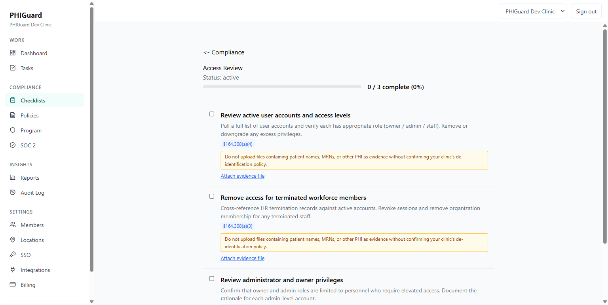
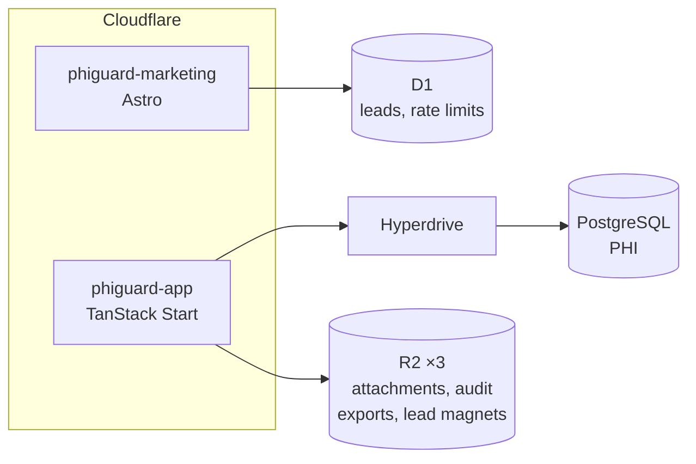
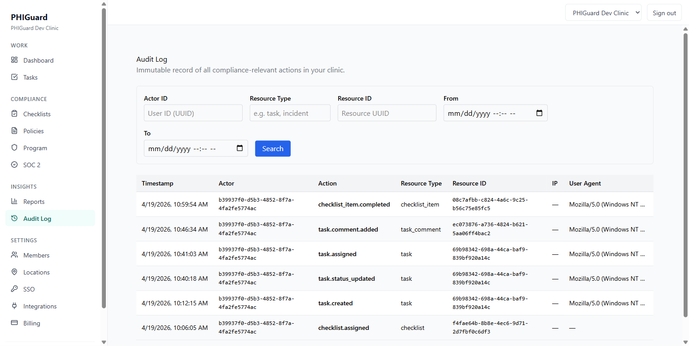
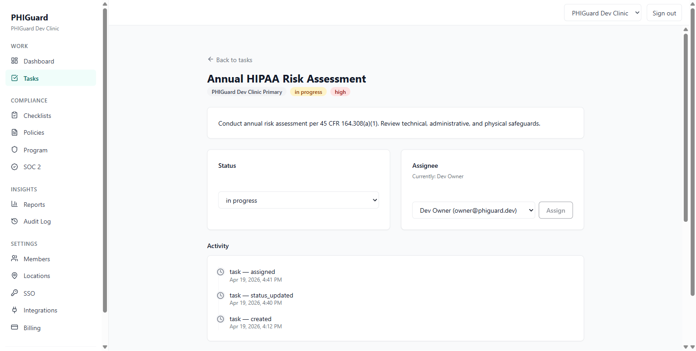
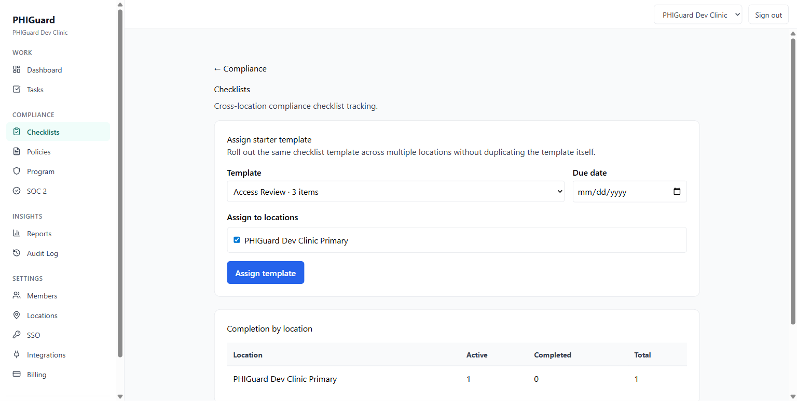
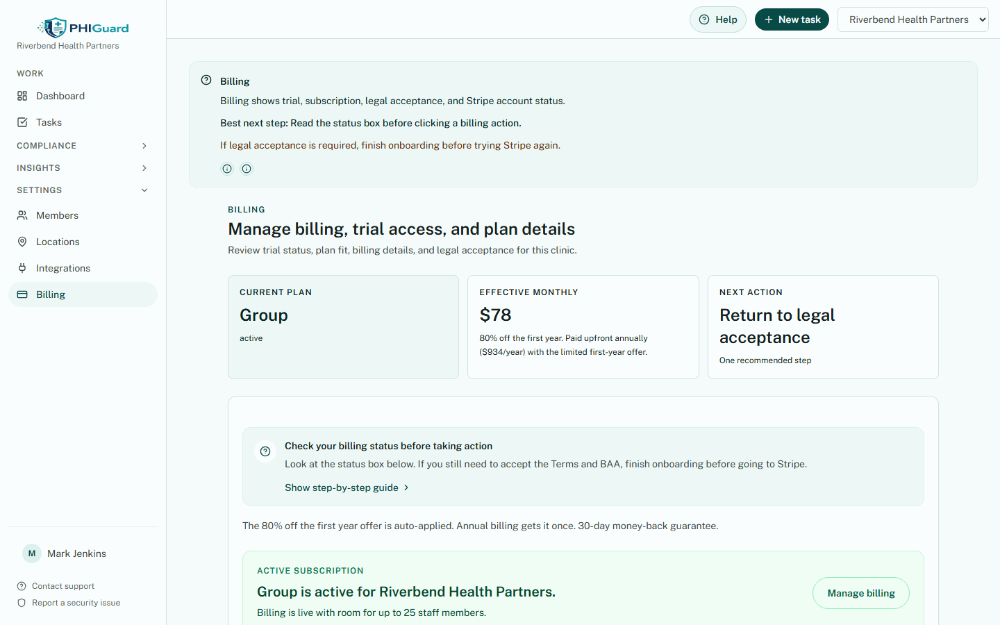

# PHIGuard

A HIPAA-native task management and compliance platform for small medical
clinics: the kind with three to fifty staff, no IT department, and no
compliance officer. Every table that can hold protected health information
lives in a file named `*.phi.ts`, and the append-only audit trail is
enforced against its own tooling. Built, shipped to production, and shut
down.

> [!IMPORTANT]
> **Status: retired.** PHIGuard was deployed and running at `my.phiguard.app`
> through mid-June 2026, when active development on it stopped. The AWS
> infrastructure is torn down and the domains are set to lapse. This
> repository is published as an engineering artifact, for reading and
> review. It is not accepting signups and is not maintained.

> [!NOTE]
> Built solo by [Angel Campa](https://github.com/AngelCampa1), with heavy AI
> assistance. See [Built with AI agents](#built-with-ai-agents) below. No
> license is granted; this source is published for reading and review only.
> See [LICENSE](LICENSE).

> [!NOTE]
> **About this snapshot.** This is a curated export of a private repository
> built over **876 commits between 2026-04-14 and 2026-08-11**. Active
> development ran to mid-June 2026, and the remainder prepared this export. That
> history is squashed into a single commit because it carried operational logs
> and a corporate identity that no longer exists. The work of preparing this
> snapshot for publication is folded into that same commit, and is described in
> [docs/goal-portfolio-public/LEDGER.md](docs/goal-portfolio-public/LEDGER.md).
> A squashed commit is a weak signal on its own, so those figures are recorded in
> [provenance.json](portfolio/provenance.json), read out of git by
> `scripts/portfolio-metrics.mjs --record-provenance` rather than reconstructed
> afterwards. 35 of the commits are attributed to an AI agent identity; the work
> was done with heavy AI assistance and that seemed worth leaving visible rather
> than collapsing into one name.

---



*A HIPAA-cited compliance checklist, captured during the QA sweep of
2026-04-19 against a local dev clinic, not a mockup, not seeded data with
real patients. The audit-log screenshot carries dev-workspace identifiers
and a raw user-agent string not meant for public reuse, so this checklist
image is the hero instead.*

---

## Contents

- [If you read one thing](#if-you-read-one-thing)
- [What it did](#what-it-did)
- [Architecture](#architecture)
- [Engineering worth pointing at](#engineering-worth-pointing-at)
- [By the numbers](#by-the-numbers)
- [Testing](#testing)
- [Screenshots](#screenshots)
- [Repository map](#repository-map)
- [Documentation](#documentation)
- [Built with AI agents](#built-with-ai-agents)
- [Running it locally](#running-it-locally)
- [Who built this](#who-built-this)
- [License](#license)

---

## If you read one thing

The best evidence for the verification discipline behind this repository is
a bug it found in its own test suite. [The screenshot archive was wrong for
four months, and every assertion covering it stayed
green.](portfolio/ENGINEERING-LOG.md) The automated capture spec only
rejected a screen on an HTTP error, but the router redirects on the client,
so a screen the seeded account couldn't reach still wrote to disk under the
requested screen's filename. 38 of the original 43 captures were the
onboarding gate wearing other screens' names, including all four images this
README used as its hero strip at the time, found while preparing this
snapshot for publication, not during development. Three assertions passed
the whole time; none of them checked the property anyone actually cared
about.

The fix is in the same file the bug was in: the spec now compares the
landed pathname against the requested one and throws, `redirected to
/app/dashboard: the account cannot reach this screen`, on any mismatch
between them.

## What it did

PHIGuard combined task management with a real compliance program for clinic
staff who had neither the budget nor the training for enterprise GRC
software. A clinic administrator could roll out checklists cited to
specific HIPAA sections across every location, assign tasks with a visible
activity trail, log incidents, publish policies, keep a risk register, and
generate a Business Associate Agreement, all on one flat, per-clinic
subscription with no per-user fees. Every write to a PHI-adjacent table
produced an append-only audit event, filterable by actor, resource and date
range, so an administrator could hand an external auditor a real trail
instead of a spreadsheet assembled after the fact.

The compliance content is grounded in a careful reading of the HIPAA
Security and Privacy Rules by an engineer. It was never reviewed by
counsel, and it is not legal advice.

---

## Architecture

Two independently deployed Cloudflare Workers sharing one TypeScript monorepo: a
marketing plane that never touches patient data, and a product plane that does.
Most of the rest follows from keeping those apart.



The marketing site cannot reach the PHI database. Its leads and rate-limit
buckets live in D1, a physically separate store. That is why PostHog's browser
SDK is allowed on the public site and forbidden behind auth: authenticated
analytics go through a same-origin `/api/analytics/product` proxy with an
explicit event allowlist, route normalization, and a scalar-only property
sanitizer, so no third-party JavaScript ever runs on a page that can render PHI.

**[→ Full architecture notes](portfolio/ARCHITECTURE.md)**, covering request
path, data model, package graph, and deploy topology.
**[→ The decisions behind it](portfolio/DECISIONS.md)**, and which ones held.

---

## Engineering worth pointing at

**`.phi.ts` as a filename convention.** Any schema module defining a table that
stores or references protected health information is named `*.phi.ts`: 18 of
48. This turns "which tables can hold PHI?" into a `git ls-files` query instead
of a code review. Two custom review agents in `.claude/agents/` enforce it.

**The audit trail constrains its own tooling.** `audit_events` is append-only
behind a Postgres trigger and carries a foreign key to `organizations`. That
guarantee is real enough that the demo seed in this repository *cannot delete
the workspace it created*: it counts existing audit rows and refuses, telling
you to recreate the database instead. An immutability guarantee that inconveniences
its author is worth more than one that only appears in a policy document.

**Audit coverage is a test, not a claim.**
[`packages/integration/src/audit-coverage.test.ts`](packages/integration/src/audit-coverage.test.ts)
starts a real PostgreSQL instance via testcontainers and asserts that each of 10
named PHI-adjacent mutation paths writes its audit event. 11 event types in
all, since accepting legal documents records the Terms and the BAA separately.

**Architecture rules as unit tests.** Three static-contract suites read source
files off disk and assert structural properties about it. Over a thousand
assertions between them cover things like the support widget being mounted
client-only, the AI proxy signing its upstream requests, Turnstile keys not
being hardcoded, and the dissolved corporate identity appearing nowhere in the
tree. They fail on a refactor that quietly breaks an invariant no runtime test
would notice. The identity guard at
[`packages/knowledge/src/static-contracts.test.ts:250`](packages/knowledge/src/static-contracts.test.ts)
stores its own needles base64-encoded so that the guard does not republish the
three strings it exists to keep out, and decodes them at runtime so the guard
file is scanned like every other file.

**One source of truth for product facts.** `@phiguard/knowledge` holds plan
names, prices, guarantees, subprocessors and support addresses as typed source
compiled to JSON, consumed by the app, the marketing site, the email templates
and the generated PDFs. A price cannot drift between the pricing page and the
invoice, and a drift checker runs as part of `pnpm test`.

**Edge-native data access.** Workers share module scope across requests in one
isolate, so a cached database client or auth instance leaks tenant context
between requests. [ADR 0018](docs/adr/0018-hyperdrive-request-scoped-db.md)
records the fix: per-request construction inside an `AsyncLocalStorage` scope
that also carries the acting user, so `auditedWrite()` can attribute writes
without threading a parameter through every call site.

**Also in here:** a 5-role RBAC model with its own route-level spec; 64
React-PDF compliance document templates sharing design tokens with the web app;
an antivirus scanning pipeline for uploads; dual-store rate limiting;
AES-encrypted OAuth tokens; a bespoke design-system linter wired in as a build
gate; and an 869-entry programmatic SEO corpus with an AI-citability checker.

**[→ The security model in detail](portfolio/SECURITY.md)**

---

## By the numbers

Every figure here is produced by [`scripts/portfolio-metrics.mjs`](scripts/portfolio-metrics.mjs),
which counts only `git ls-files` output and classifies each file. Run
`node scripts/portfolio-metrics.mjs` to reproduce, or
`pnpm portfolio:metrics:check` to fail if anything drifted. The full breakdown
is in [METRICS.md](portfolio/METRICS.md).

| | |
| --- | ---: |
| Authored code lines / files | **159,092** / 835 |
| Application source | 85,354 |
| Unit tests | 54,084 |
| End-to-end tests | 3,118 |
| Automation scripts | 10,984 |
| Test cases / test files / suites | **2,109** / 182 / 331 |
| Test-to-source ratio | **0.66 : 1** |
| Postgres tables / enums / migrations | 49 / 29 / 62 |
| PHI-tagged schema modules | 18 of 48 |
| Product routes / API routes | 41 / 18 |
| Marketing pages / generated content entries | 46 / 869 |
| Workspace packages | 15 packages, 2 apps |
| Terraform resources | 61 |

That total is code only: application source, tests, automation scripts, SQL
migrations, Terraform and stylesheets. Documentation, config and the 869-file
marketing content corpus are all measured too (see
[METRICS.md](portfolio/METRICS.md)), but kept out of the headline figure.
So are generated files: Drizzle migration snapshots, the TanStack route
manifest, generated redirect tables, build output and the lockfile come to 15
files and 37,871 lines, and claiming them as authored work would be dishonest.

---

## Testing

```bash
pnpm test              # all workspaces
pnpm test:coverage     # v8 coverage per package → portfolio/coverage.json
```

2,109 test cases across 182 files. The domain layer is covered properly; the
presentation layer deliberately is not.

Some suites spin up real PostgreSQL through testcontainers and skip themselves
when no container runtime is available, so run these with Docker started or the
numbers come out low. `run-coverage.mjs` reports the skip count per package
rather than letting a partial run pass as a full one.

| Package | Line coverage | | Package | Line coverage |
| --- | ---: | --- | --- | ---: |
| `pdf` | 97.8% | | `integration` | 91.8% |
| `baa` | 96.2% | | `billing` | 91.5% |
| `knowledge` | 95.8% | | `auth` | 82.0% |
| `audit` | 95.7% | | `email` | 82.3% |
| `lead-magnets` | 94.7% | | `marketing-db` | 73.3% |
| `compliance` | 94.0% | | `web` | 36.1% |
| `db` | 92.9% | | `marketing` | 17.5% |
| | | | `ui` | 4.9% |

**The honest aggregate across everything measured is 48.9%.** Across
`packages/*` excluding `ui` (the domain, data, auth, billing and compliance
layer), it is **94.2%**. The gap is `web`, `marketing` and `ui`, and it is there
on purpose: the repository's own contributor guide says *"For UI code in
`apps/web`: write tests for logic and server functions. Do not write tests for
markup rendering."* Server functions, domain logic and data access are tested;
React components rendering markup are not. Both numbers are here because quoting
only the flattering one is how coverage sections become useless.

`brand` and `config` have no tests and are excluded rather than counted as
zeroes: one is a constants file, the other is shared ESLint and TypeScript
presets.

**[→ Testing in detail, including the gaps](portfolio/TESTING.md)**

---

## Screenshots

11 product screens and 39 marketing pages, all captured from a local run of
the real application. 46 came from the automated capture pipeline; the four
below came from a manual QA sweep. **[→ Full archive](portfolio/SCREENSHOTS.md)**
has all of them.

The audit log below predates QA finding P2-008: the Actor column shows a raw
UUID because the join against `users` that resolves it to a name shipped
after this capture was taken. `auditor` is one of three roles allowed to read
this screen; the fix is recorded in
[docs/qa/prod-readiness-findings.md](docs/qa/prod-readiness-findings.md) as
P2-008, FIXED. `actor_id` itself carries no foreign key. The only one on
`audit_events` is `tenant_id → organizations`.

<table>
<tr>
<td width="50%"></td>
<td width="50%"></td>
</tr>
<tr>
<td>Audit log, from the QA sweep of 2026-04-19</td>
<td>Task activity, read back out of its own audit events</td>
</tr>
<tr>
<td width="50%"></td>
<td width="50%"></td>
</tr>
<tr>
<td>Template rollout across locations</td>
<td>Plan and billing, with legal-acceptance state (synthetic seed account)</td>
</tr>
</table>

**The product archive holds 11 screens: seven automated captures and four
hand-taken QA screens.** [→ Full account](portfolio/ENGINEERING-LOG.md) of the
redirect bug that produced 38 mislabelled captures, deleted rather than
relabelled, and of the four hand-taken QA screens promoted here to replace
them.

---

## Repository map

| Path | |
| --- | --- |
| `portfolio` | **Start here.** Architecture, decisions, engineering log, security, testing, metrics, screenshots |
| `apps/web` | Product application: TanStack Start, React 19, Vite 7 |
| `apps/marketing` | Marketing site: Astro 5, Tailwind 4 |
| `packages/db` | Drizzle schema, migrations, Postgres client |
| `packages/auth` | better-auth config, session helpers, RBAC |
| `packages/audit` | Append-only audit writer, PHI-redacting logger |
| `packages/compliance` | Checklist, policy, incident, risk domain logic |
| `packages/billing` | Stripe plans, entitlements, feature gates |
| `packages/baa` | BAA and Terms document generation and acceptance |
| `packages/integration` | Calendar integrations, cross-package invariant tests |
| `packages/knowledge` | Typed product facts with a drift checker |
| `packages/pdf` | 64 React-PDF compliance document templates |
| `packages/ui` | Shared Shadcn-based components |
| `packages/email` | Resend + React Email templates |
| `packages/marketing-db` | Cloudflare D1 schema for the marketing plane |
| `packages/brand`, `packages/lead-magnets`, `packages/config` | Identity, lead magnets, shared tooling presets |
| `infra/terraform` | AWS infrastructure from the pre-Cloudflare era |
| `docs/adr`, `docs/hipaa`, `docs/runbooks` | Decision records, safeguard mapping, operational runbooks |
| `docs/audits`, `docs/qa`, `docs/marketing`, `docs/getting-badges` | Working documents kept as they were written |

---

## Documentation

[portfolio/](portfolio/) is retrospective, written for a reader, and every
claim traces to a file. Start with its own [index](portfolio/README.md).
[docs/](docs/) is prospective working residue: plans, audit runs, and
session notes written to the author while building, not curated for review.

---

## Built with AI agents

35 of the 876 commits in the private source history are attributed to an AI
agent identity ("AI Alex"), recorded in
[provenance.json](portfolio/provenance.json) rather than reconstructed after
the fact, since the published history is squashed to a single commit.

`CLAUDE.md`, `AGENTS.md`, `.claude/agents/` and `.claude/settings.json` are
committed on purpose and reviewed like source, not scrubbed for
publication.

One concrete gate:
[`.claude/agents/hipaa-reviewer.md`](.claude/agents/hipaa-reviewer.md) and
[`.claude/agents/schema-migration-reviewer.md`](.claude/agents/schema-migration-reviewer.md)
are specialized review agents wired into the merge process.
`hipaa-reviewer` fails a review that logs PHI outside `logger.safe()`, or
that writes to a `*.phi.ts` table without a same-transaction audit event.
`schema-migration-reviewer` fails a migration that adds a `*.phi.ts` table
without a matching audit hook, or a new table missing `tenant_id`. Both are
named in [SECURITY.md](portfolio/SECURITY.md), which also records the
honest gap: there is no automated test for the `.phi.ts` naming convention
itself, only agent review and `CLAUDE.md` policy.

---

## Running it locally

**Prerequisites:** Node 22+, pnpm 9.15.4, Docker.

```bash
pnpm install
docker compose up -d              # Postgres + Mailpit
cp .env.example .env              # set BETTER_AUTH_SECRET: openssl rand -hex 32
node scripts/reset-local-db.mjs   # create the database and apply all 62 migrations
```

Use `scripts/reset-local-db.mjs` rather than the drizzle-kit path
(`pnpm --filter @phiguard/db migrate`): drizzle-kit swallows the underlying
Postgres error when a statement fails, which makes a broken local database very
hard to diagnose. The script applies the SQL directly and names the file that
failed.

```bash
bash scripts/dev-local.sh         # the app on http://localhost:3300
pnpm --filter @phiguard/marketing dev   # the marketing site on :4321
```

`dev-local.sh` runs the real `workerd` runtime through `wrangler dev`, not
`vite dev`. It generates a routeless copy of `wrangler.jsonc` first, because the
production config declares a custom-domain route and under `wrangler dev` that
makes wrangler rewrite the inbound `Origin` to `http://my.phiguard.app`, which
better-auth rejects, since its trusted origins only contain the `https://` form.

To populate a workspace worth looking at:

```bash
pnpm --filter @phiguard/web seed:demo
```

This builds "Riverbend Health Partners": 3 locations, 5 users covering every
RBAC role, tasks across every status, checklists mid-completion, incidents,
policies, a risk register, training records, vendor BAAs and audit-evidence
records, using the application's own domain functions, so the resulting
audit trail is genuine rather than inserted. Sign in as
`owner@demo.phiguard.dev` (also `admin@`, `manager@`, `staff@`, `auditor@`)
with `DemoPassword123!`. All data is synthetic `@faker-js/faker` output from
a fixed seed.

### One dependency is stubbed

The authenticated support widget came from `@ventora/ai-cs`, a package on a
private registry that is not part of this snapshot. The dependency was removed
and the import resolves to a documented no-op stub
([`apps/web/src/vendor-stubs/`](apps/web/src/vendor-stubs/)), so `pnpm install`
and the build both work. **The support launcher does not render when you
run this repo.**

Everything that talks *to* that widget is real and unstubbed and worth reading:
the same-origin BFF proxy, HMAC request signing with a nonce replay table and
timestamp-skew rejection, and the PHI-safe analytics bridge, all in
`apps/web/src/server/ai-cs-*.server.ts`.

---

## Who built this

Angel Campa, solo, with heavy AI assistance disclosed above in
[Built with AI agents](#built-with-ai-agents).
[github.com/AngelCampa1](https://github.com/AngelCampa1)

## License

No license is granted. This source is published for reading and review as a
portfolio piece; all rights are reserved. See [LICENSE](LICENSE).
