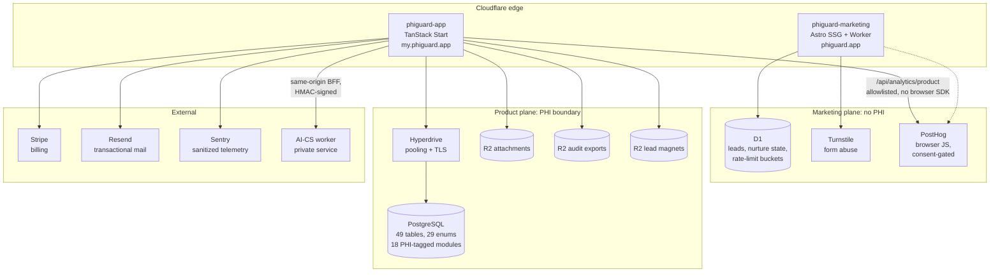
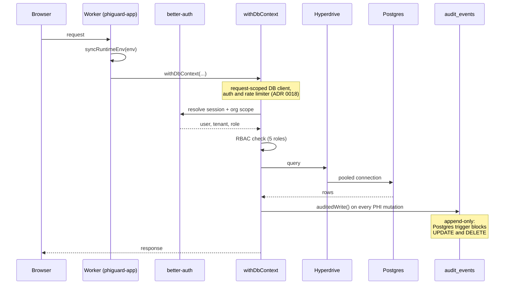
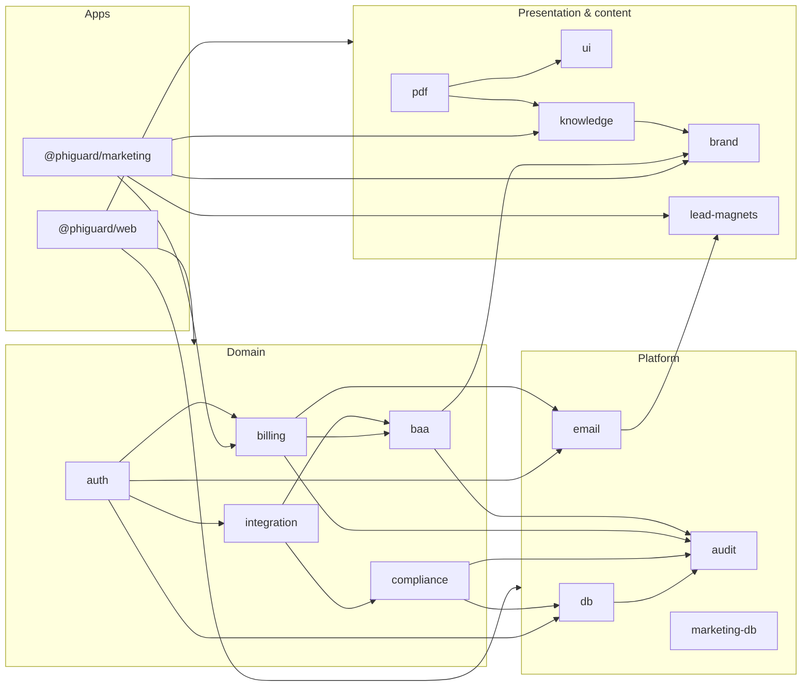

# PHIGuard architecture

How the system was put together, and why. Counts referenced here come from
[`METRICS.md`](./METRICS.md), regenerated by `node scripts/portfolio-metrics.mjs`.

PHIGuard ran as two independently deployed Cloudflare Workers sharing one
TypeScript monorepo: a marketing plane that never touched patient data, and a
product plane that did. Keeping those two planes apart is the single decision
most of the rest of the architecture follows from.

---

## System overview

**The marketing plane never reaches the PHI database.** Leads, nurture state and
rate-limit buckets live in Cloudflare D1, a physically separate store. That is
why PostHog's browser SDK is allowed on `phiguard.app` and forbidden inside
`my.phiguard.app`: there is no authenticated surface on the marketing side for
it to observe.

**Authenticated analytics go through a same-origin proxy.** `apps/web` ships no
third-party analytics JavaScript. Events are posted to
`/api/analytics/product`, which enforces an explicit event allowlist, normalizes
routes so record ids never appear in a path, and runs a scalar-only property
sanitizer before anything leaves the origin.

---

## Product request path

Workers have no long-lived process, and module-scope state is shared across
requests in the same isolate. Caching a database client, an auth instance or a
rate limiter at module scope would leak one tenant's context into another's
request. **ADR 0018** records the fix: every one of those is constructed per
request inside `withDbContext`, an `AsyncLocalStorage` scope that also carries
the acting user id so `auditedWrite()` can attribute writes without threading a
parameter through every call site.

---

## Data model

49 PostgreSQL tables across 48 schema modules, 29 enum types, 62 migrations.
Cloudflare D1 adds 3 tables and 5 migrations for the marketing plane.

**The `.phi.ts` convention.** Any schema module defining a table that stores or
references protected health information is named `*.phi.ts`: 18 of the 48. This
makes "which tables can hold PHI?" a question `git ls-files` can answer, rather
than one requiring a reviewer to read every schema file. Two custom review
agents in `.claude/agents/` enforce it on changed files.

**`audit_events` is append-only.** A Postgres trigger rejects `UPDATE` and
`DELETE`, and the table carries a foreign key to `organizations`. The guarantee
is real enough that it constrains this repository's own tooling: the demo seed
in `apps/web/scripts/demo-seed.ts` cannot delete the workspace it created, so it
counts existing audit rows and refuses with instructions to recreate the
database instead.

**Audit coverage is a test, not a claim.**
`packages/integration/src/audit-coverage.test.ts` starts a real PostgreSQL
instance via testcontainers and asserts that each of 10 named PHI-adjacent
mutation paths writes its audit event. 11 event types in all, since accepting
legal documents records the Terms and the BAA separately. "Everything that
touches PHI is audited" becomes a checkable invariant rather than a sentence in
a policy document.

---

## Package graph

15 shared packages behind the two apps. Arrows point from consumer to
dependency; `@phiguard/web` depends on all but `config` and `marketing-db`'s
peers, so its edges are collapsed for readability.

`@phiguard/audit` is the sink everything drains into and depends on nothing
itself: the one hard rule that keeps the audit trail from acquiring a cycle
with the code it observes.

**`@phiguard/knowledge`** holds product facts (plan names, prices, guarantees,
subprocessors, support addresses) as typed source compiled to JSON. The app,
the marketing site, the email templates and the PDF documents all read from it,
so a price cannot drift between the pricing page and the invoice. A drift
checker runs as part of `pnpm test`.

---

## Deploy topology

| Surface | Worker | Domains | Command |
| --- | --- | --- | --- |
| Product app + API | `phiguard-app` | `my.phiguard.app` | `pnpm deploy:web` |
| Marketing site | `phiguard-marketing` | `phiguard.app`, `www.phiguard.app` | `pnpm deploy:marketing` |
| Lead-magnet PDFs | none (R2 objects) | none | `pnpm deploy:pdfs` |

`pnpm deploy:touched` diffs against `HEAD~1` and deploys only the surfaces a
change actually affected.

**Scheduled work.** One cron trigger, `0 3 * * *`, runs the nightly audit export
to the `phiguard-audit-exports` R2 bucket. It is guarded three ways: an
emergency read-only flag (`PHIGUARD_READ_ONLY_MODE`), a
`SCHEDULED_JOBS_ENABLED` toggle, and a bounded retry loop, because a cold
Hyperdrive connection at 03:00 is a normal event rather than an error.

**Local development.** `scripts/dev-local.sh` runs the real `workerd` runtime
rather than `vite dev`, and generates a routeless copy of `wrangler.jsonc` first:
the production config declares a custom-domain route, and under `wrangler dev`
that makes wrangler rewrite the inbound Origin to `http://my.phiguard.app`,
which better-auth then rejects because its trusted origins only contain the
`https://` form.

---

## Decision records

| ADR | Subject |
| --- | --- |
| [0001](../docs/adr/0001-stack-choice.md) | Stack choice |
| [0002](../docs/adr/0002-hipaa-architecture.md) | HIPAA architecture *(carries a historical banner, superseded in part)* |
| [0009](../docs/adr/0009-partner-portal-privacy.md) | Partner portal: no clinic identifiers or exact revenue |
| [0010](../docs/adr/0010-alb-waf-provisioning.md) | ALB and WAF association provisioned |
| [0011](../docs/adr/0011-ecs-task-def-lifecycle-ignore.md) | ECS task definition lifecycle: ignore changes after initial deploy |
| [0016](../docs/adr/0016-marketing-email-architecture.md) | Marketing email architecture |
| [0017](../docs/adr/0017-migration-numbering-discipline.md) | Drizzle migration numbering discipline |
| [0018](../docs/adr/0018-hyperdrive-request-scoped-db.md) | Hyperdrive + per-request DB scoping for `apps/web` |

**[→ What became of each of these](./DECISIONS.md)**, which decisions survived
production, which are now describing infrastructure that no longer exists, and
the five decisions that shaped the codebase without ever getting a record.

The numbering is sparse and the AWS-era records (0010, 0011) describe
infrastructure that Cloudflare Workers later replaced. ADR 0002 carries its own
banner saying so. ADR 0017 exists because concurrent branches kept minting the
same Drizzle migration number and the resulting merges were genuinely painful.
It is the most useful record in the set precisely because it was written after
the mistake rather than before it.
