# Screenshot archive

<!-- Generated by scripts/build-screenshot-index.mjs. Do not edit by hand. -->

11 product screens and 39 marketing pages (14.3 MB total), all captured from a local run of the real application, not mockups, and not a staging environment with hand-placed data. 46 came out of the automated capture runs; 4 were taken by hand during a QA sweep and are listed separately below.

The product screens are populated by `apps/web/scripts/demo-seed.ts`, a deterministic `@faker-js/faker` seed built through the application's own domain functions rather than direct row inserts.

> **Read this before judging the product by this archive.** This archive is a fraction of what the capture spec asks for. The original run wrote 43 files, but the spec only failed a screen on HTTP >= 400, and the router redirects on the client, so every screen the seeded account could not reach still resolved 200 and was written to disk under the requested screen's name. 38 of the 43 files were the onboarding gate wearing another screen's filename. Those were deleted rather than relabelled, and the spec now compares the landed URL with the requested one. What is left is what was genuinely captured. Re-running the full archive needs Docker, a seeded account that has completed onboarding, and a re-capture.

Seeded workspace: **Riverbend Health Partners**

> 3 locations · 5 members · 18 tasks · 2 comments · 6 checklists · 7 items completed · 6 incidents · 4 policies published · 8 risk items · 8 training completed · 7 controls evidenced

That is what the seed builds. It is **not** a description of what these captures show. The screens that would have shown it are the ones the redirect bug destroyed.

**No real patient data appears anywhere in this archive.** The seed is synthetic by
construction and the repository forbids committing PHI to fixtures.

## Regenerating

```bash
pnpm --filter @phiguard/web exec playwright test portfolio-screenshots --project=chromium
cd apps/marketing && node scripts/capture-portfolio-screenshots.mjs
node scripts/build-screenshot-index.mjs
```

---

## Product application

### The compliance product, from the manual QA sweep

These are the only verified captures of the compliance features in a populated state. They were taken by hand on 2026-04-19 against a local dev clinic, not by the capture spec, so they cannot be reproduced by re-running a script. Each entry records the filename it had in the QA session. The organization shown is `PHIGuard Dev Clinic`, a development workspace.

<table>
<tr>
<td width="50%" valign="top">
<br>
<sub><code>/app/audit</code><br>Audit log — append-only record, filterable by actor, resource type, resource ID and date range. Captured before QA finding P2-008 landed, so the Actor column still shows raw ids; the shipped UI resolves them to names</sub>
</td>
<td width="50%" valign="top">
<br>
<sub><code>/app/compliance/checklists/:id</code><br>Access Review checklist — items cited to 45 CFR §164.308, each with an inline PHI warning on evidence upload</sub>
</td>
</tr>
<tr>
<td width="50%" valign="top">
<br>
<sub><code>/app/compliance/checklists</code><br>Checklist rollout — assign one starter template across locations without duplicating the template</sub>
</td>
<td width="50%" valign="top">
<br>
<sub><code>/app/tasks/:id</code><br>Task detail — status, assignee, and the activity trail read back out of the audit events the task's own mutations wrote</sub>
</td>
</tr>
</table>

### Practice administrator (`org_owner`)

Full access. This is what the clinic administrator who owns the compliance programme sees.

<table>
<tr>
<td width="50%" valign="top">
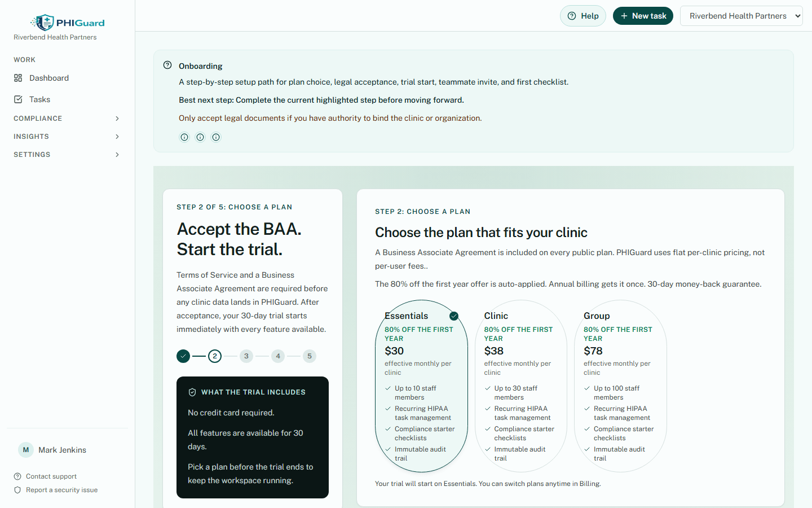<br>
<sub><code>/app/dashboard</code><br>Onboarding gate — plan choice and BAA acceptance, step 2 of 5 (synthetic seed account)</sub>
</td>
<td width="50%" valign="top">
<br>
<sub><code>/app/billing</code><br>Plan and billing, with trial and legal-acceptance status (synthetic seed account)</sub>
</td>
</tr>
</table>

### Mobile (375px)

The same account at a phone viewport, which is where a lot of clinic staff actually work.

<table>
<tr>
<td width="50%" valign="top">
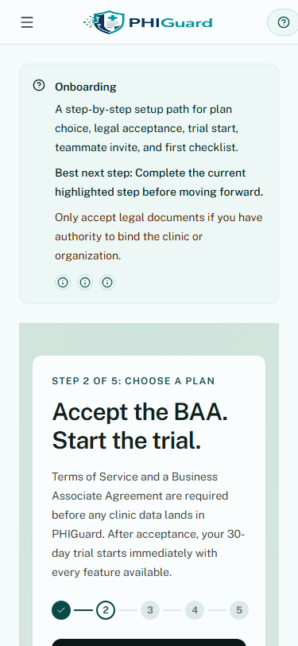<br>
<sub><code>/app/dashboard</code><br>Onboarding gate at 375px (synthetic seed account)</sub>
</td>
<td width="50%"></td>
</tr>
</table>

### Unauthenticated

Public product surfaces.

<table>
<tr>
<td width="50%" valign="top">
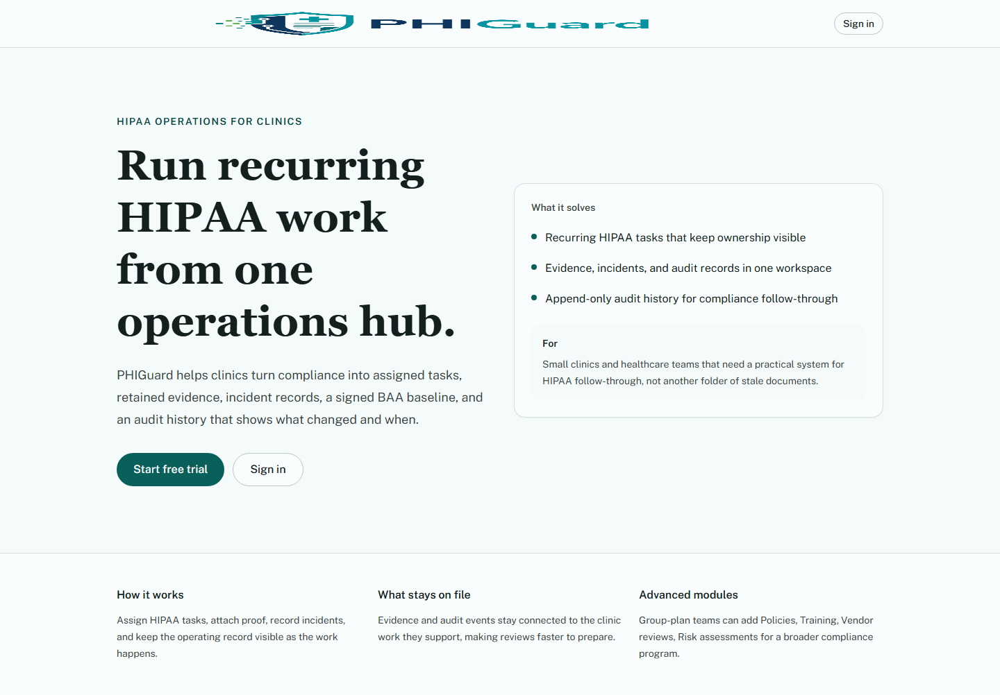<br>
<sub><code>/</code><br>Unauthenticated entry page</sub>
</td>
<td width="50%" valign="top">
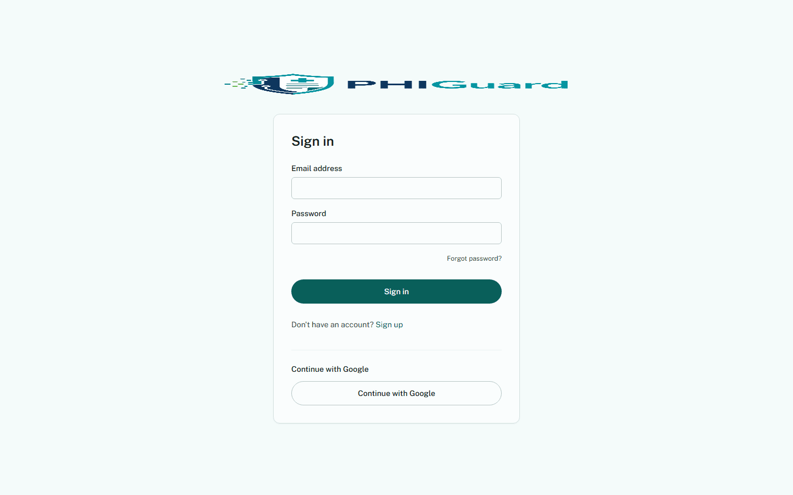<br>
<sub><code>/login</code><br>Sign in</sub>
</td>
</tr>
<tr>
<td width="50%" valign="top">
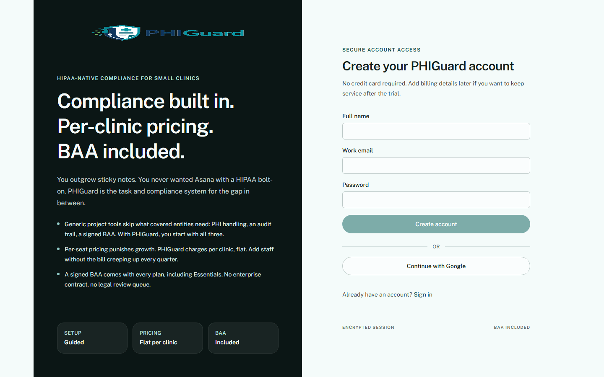<br>
<sub><code>/signup</code><br>Create account</sub>
</td>
<td width="50%" valign="top">
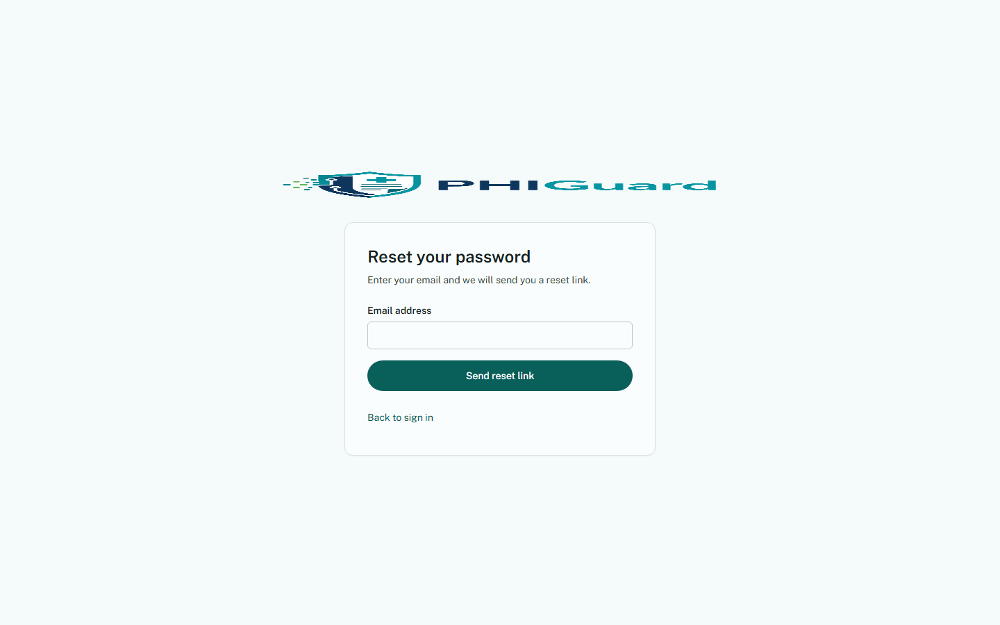<br>
<sub><code>/forgot-password</code><br>Password reset request</sub>
</td>
</tr>
</table>

---

## Marketing site

The site built hundreds of routes out of 11 programmatic content collections (see [METRICS.md](./METRICS.md) for the breakdown). Capturing all of them would be bulk rather than breadth, so this is every hand-authored page plus one representative entry per collection, resolved against the routes the build actually emitted.

### Desktop (1440px)

Sorted tallest-first so the grid pairs pages of similar length. The site itself is linked from the caption under each image, not from this order.

<table>
<tr>
<td width="50%" valign="top">
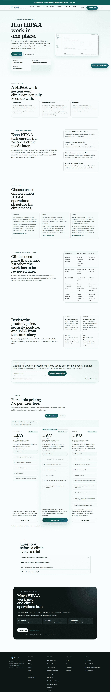<br>
<sub><code>/</code><br>Marketing home</sub>
</td>
<td width="50%" valign="top">
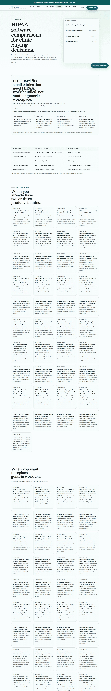<br>
<sub><code>/compare</code><br>Comparison index</sub>
</td>
</tr>
<tr>
<td width="50%" valign="top">
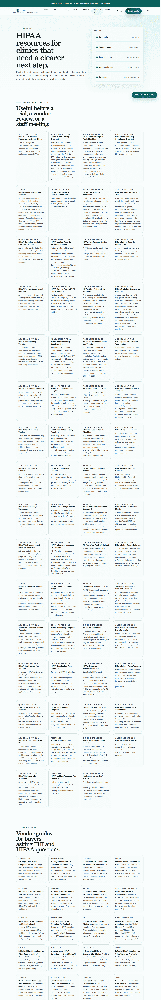<br>
<sub><code>/resources</code><br>Resource library</sub>
</td>
<td width="50%" valign="top">
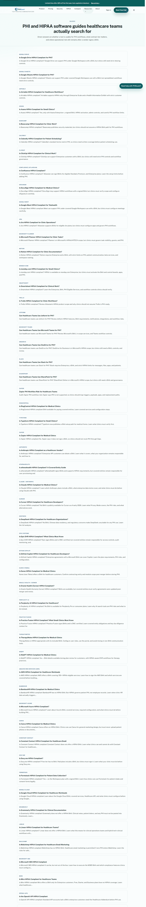<br>
<sub><code>/resources/guides</code><br>Guide index</sub>
</td>
</tr>
<tr>
<td width="50%" valign="top">
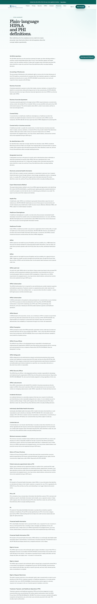<br>
<sub><code>/glossary</code><br>Compliance glossary</sub>
</td>
<td width="50%" valign="top">
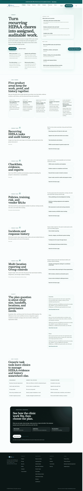<br>
<sub><code>/product</code><br>Product overview</sub>
</td>
</tr>
<tr>
<td width="50%" valign="top">
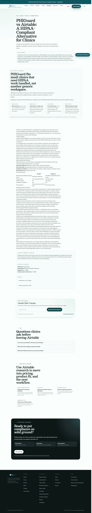<br>
<sub><code>/alternatives/airtable-alternative</code><br>Alternative page (41 entries)</sub>
</td>
<td width="50%" valign="top">
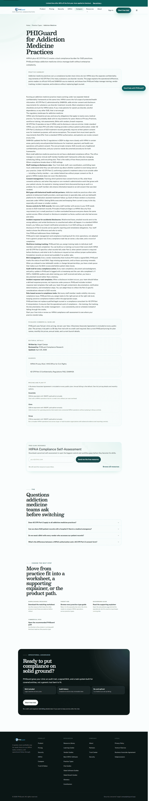<br>
<sub><code>/practice-types/addiction-medicine-practice</code><br>Practice-type page (39 entries)</sub>
</td>
</tr>
<tr>
<td width="50%" valign="top">
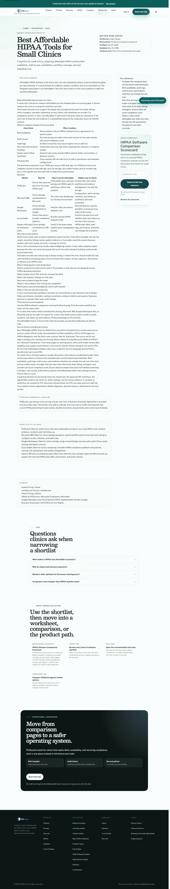<br>
<sub><code>/resources/best/best-affordable-hipaa-tools-small-clinics</code><br>Best-of roundup (55 entries)</sub>
</td>
<td width="50%" valign="top">
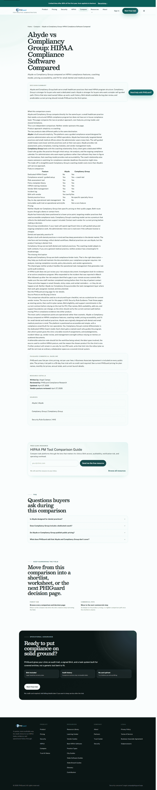<br>
<sub><code>/compare/abyde-vs-compliancy-group</code><br>Competitor comparison (41 entries)</sub>
</td>
</tr>
<tr>
<td width="50%" valign="top">
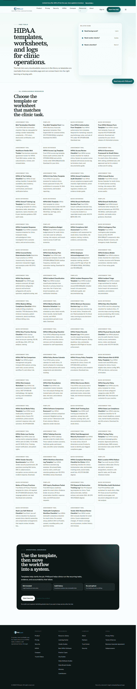<br>
<sub><code>/resources/tools</code><br>Free tools</sub>
</td>
<td width="50%" valign="top">
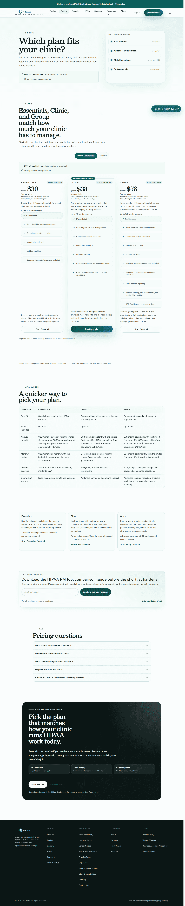<br>
<sub><code>/pricing</code><br>Per-clinic flat pricing</sub>
</td>
</tr>
<tr>
<td width="50%" valign="top">
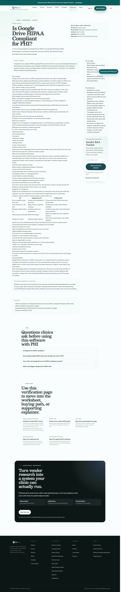<br>
<sub><code>/resources/guides/google-drive</code><br>Integration guide (91 entries)</sub>
</td>
<td width="50%" valign="top">
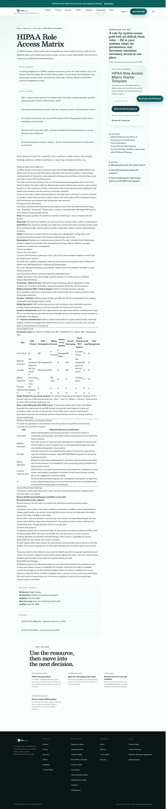<br>
<sub><code>/resources/access-matrix-starter-template</code><br>Lead-magnet resource page (63 entries)</sub>
</td>
</tr>
<tr>
<td width="50%" valign="top">
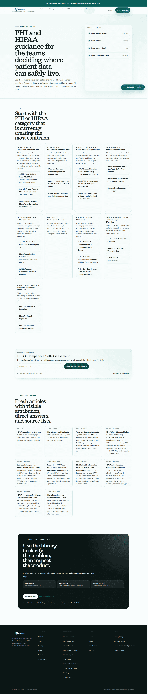<br>
<sub><code>/learn</code><br>Learn hub</sub>
</td>
<td width="50%" valign="top">
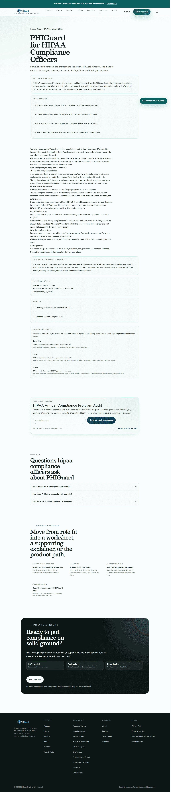<br>
<sub><code>/personas/compliance-officer</code><br>Persona page (5 entries)</sub>
</td>
</tr>
<tr>
<td width="50%" valign="top">
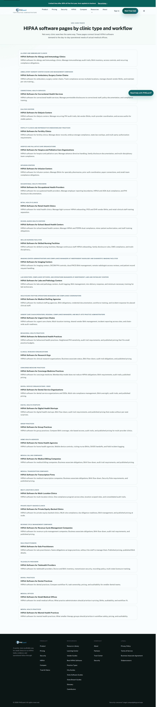<br>
<sub><code>/hipaa-software</code><br>HIPAA software index</sub>
</td>
<td width="50%" valign="top">
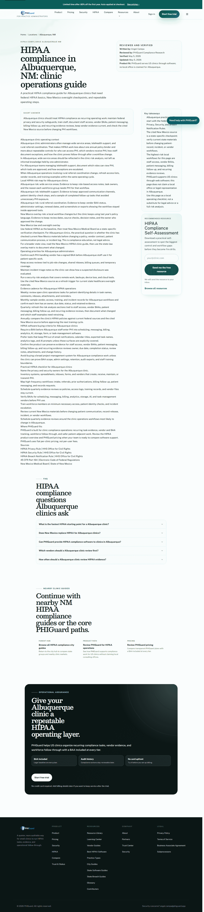<br>
<sub><code>/locations/hipaa-compliance/albuquerque-nm</code><br>State compliance guide (100 entries)</sub>
</td>
</tr>
<tr>
<td width="50%" valign="top">
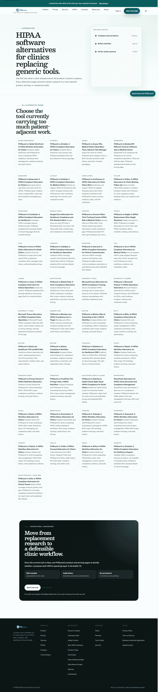<br>
<sub><code>/alternatives</code><br>Alternatives index</sub>
</td>
<td width="50%" valign="top">
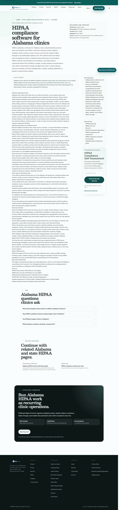<br>
<sub><code>/locations/hipaa-compliance-software/alabama</code><br>City guide (100 entries)</sub>
</td>
</tr>
<tr>
<td width="50%" valign="top">
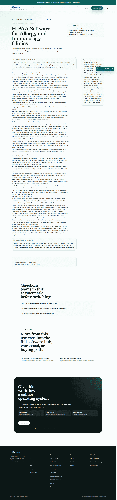<br>
<sub><code>/hipaa-software/allergy-immunology-clinics</code><br>Vertical software page (32 entries)</sub>
</td>
<td width="50%" valign="top">
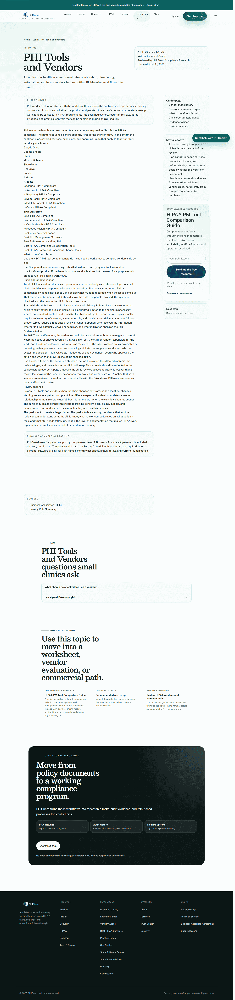<br>
<sub><code>/learn/phi-tools-vendors</code><br>Learn article (302 entries)</sub>
</td>
</tr>
<tr>
<td width="50%" valign="top">
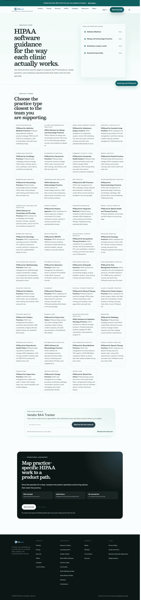<br>
<sub><code>/practice-types</code><br>Practice-type index</sub>
</td>
<td width="50%" valign="top">
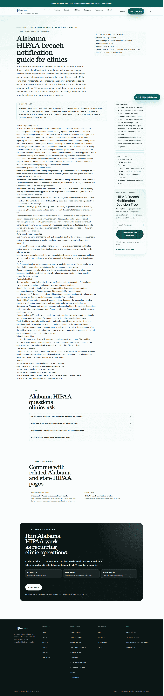<br>
<sub><code>/locations/hipaa-breach-notification/alabama</code><br>Breach-notification guide</sub>
</td>
</tr>
<tr>
<td width="50%" valign="top">
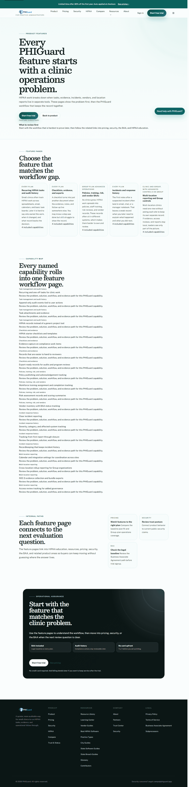<br>
<sub><code>/product/features</code><br>Feature index</sub>
</td>
<td width="50%" valign="top">
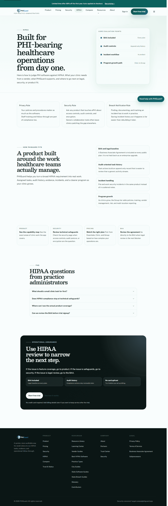<br>
<sub><code>/hipaa</code><br>HIPAA overview</sub>
</td>
</tr>
<tr>
<td width="50%" valign="top">
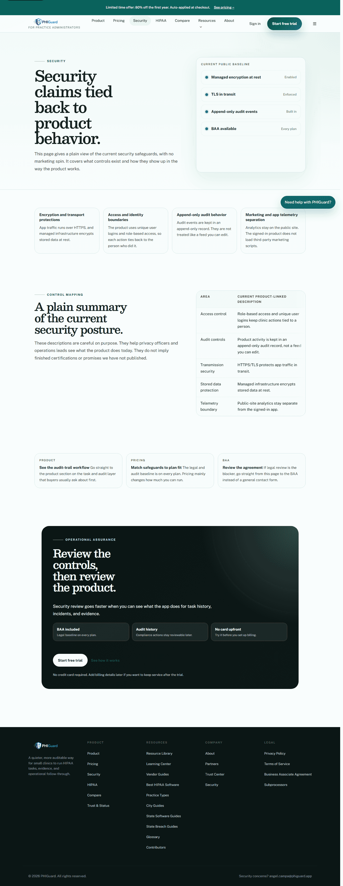<br>
<sub><code>/security</code><br>Security posture</sub>
</td>
<td width="50%" valign="top">
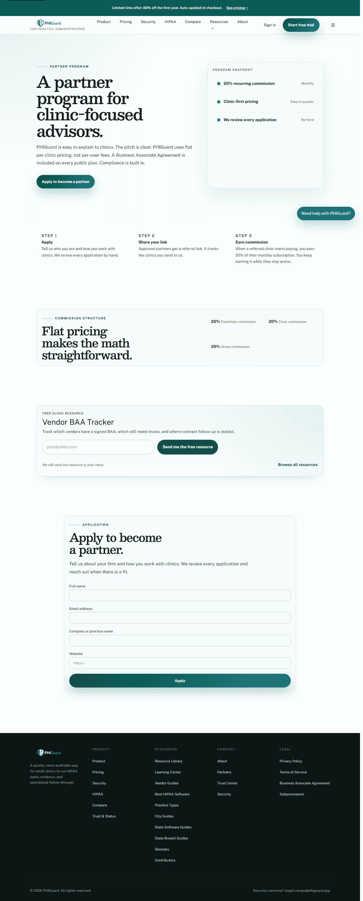<br>
<sub><code>/partners</code><br>Partner programme</sub>
</td>
</tr>
<tr>
<td width="50%" valign="top">
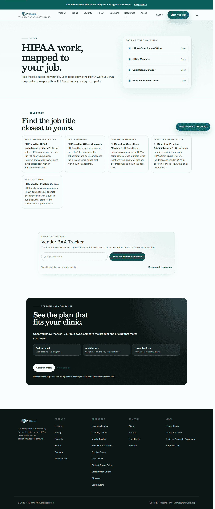<br>
<sub><code>/personas</code><br>Persona index</sub>
</td>
<td width="50%" valign="top">
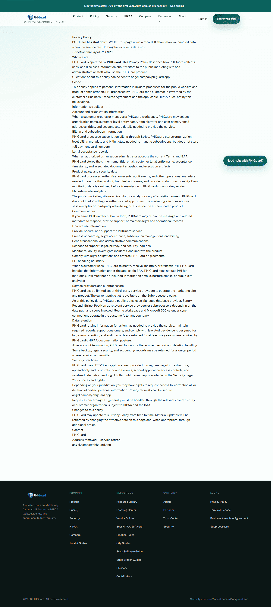<br>
<sub><code>/privacy</code><br>Privacy policy</sub>
</td>
</tr>
<tr>
<td width="50%" valign="top">
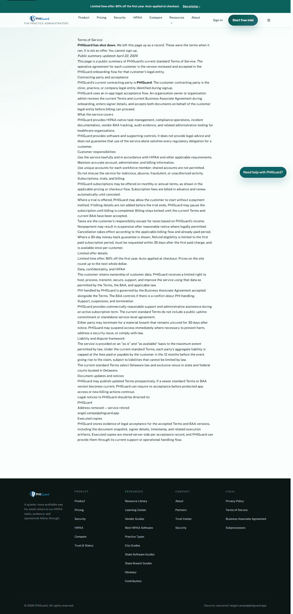<br>
<sub><code>/terms</code><br>Terms of service</sub>
</td>
<td width="50%" valign="top">
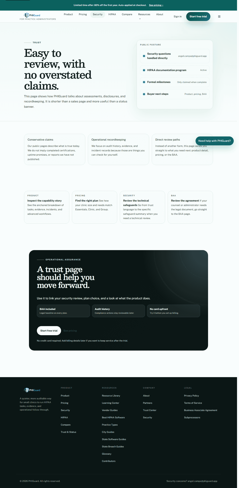<br>
<sub><code>/trust</code><br>Trust centre</sub>
</td>
</tr>
<tr>
<td width="50%" valign="top">
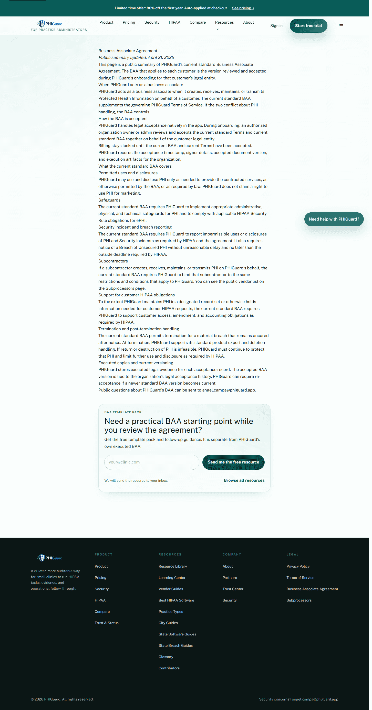<br>
<sub><code>/baa</code><br>Business Associate Agreement</sub>
</td>
<td width="50%" valign="top">
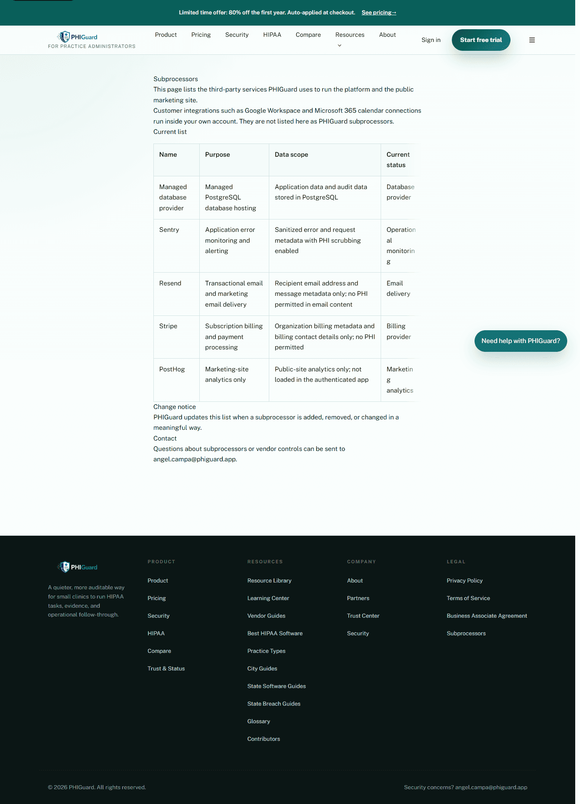<br>
<sub><code>/subprocessors</code><br>Subprocessor register</sub>
</td>
</tr>
<tr>
<td width="50%" valign="top">
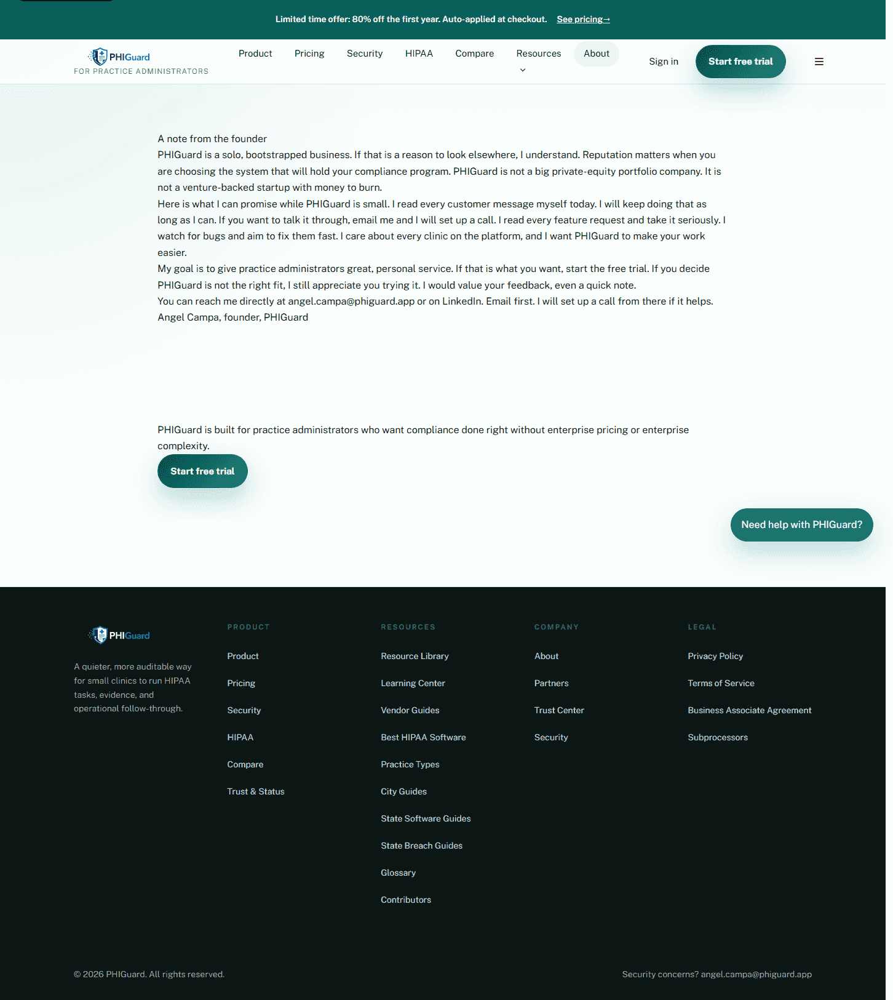<br>
<sub><code>/about</code><br>About</sub>
</td>
<td width="50%" valign="top">
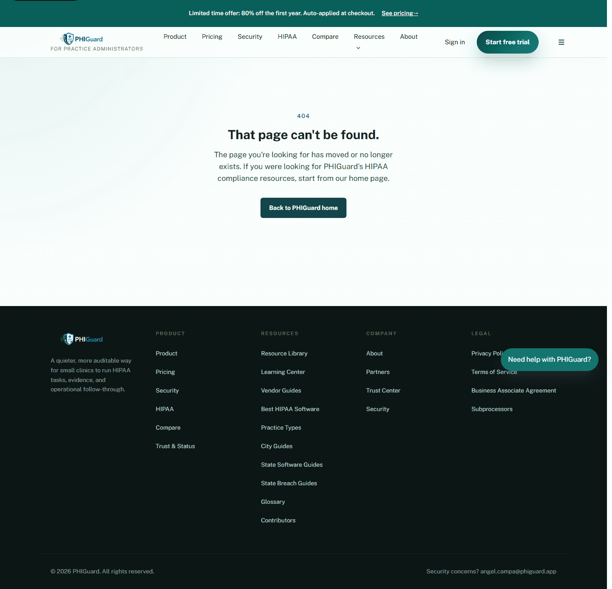<br>
<sub><code>/404</code><br>Not-found page</sub>
</td>
</tr>
</table>

### Mobile (375px)

<table>
<tr>
<td width="50%" valign="top">
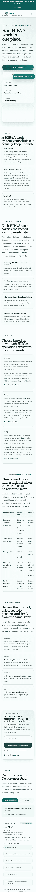<br>
<sub><code>/</code><br>Marketing home</sub>
</td>
<td width="50%" valign="top">
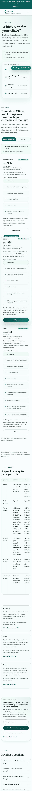<br>
<sub><code>/pricing</code><br>Per-clinic flat pricing</sub>
</td>
</tr>
<tr>
<td width="50%" valign="top">
<br>
<sub><code>/learn/phi-tools-vendors</code><br>Learn article (302 entries)</sub>
</td>
<td width="50%"></td>
</tr>
</table>
